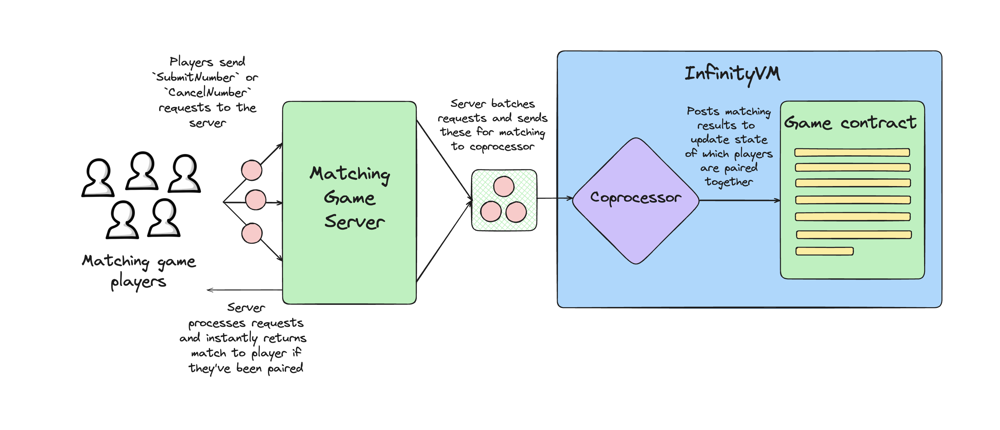

# Offchain App (Simple): Matching Game

In this section, we walk through a simple example of an offchain app server: a matching game.

## Overview of Matching Game

The matching game is very simple:

1. Each player submits their favorite number.
1. The game pairs together players who have the same favorite number.
1. The matching game contract stores which players are paired together.

## High-level user flow

The user flow looks like this:



1. A player sends their favorite number through a `SubmitNumber` call to the server. If the player wants to cancel this and submit another number later, they can make a `CancelNumber` call to the server.
1. The game server runs the matching logic in real-time and returns a match to the player if they've been paired with someone else who submitted the same number.
1. The game server has a background process that regularly batches requests from players. It sends each batch along with the relevant state of previous requests to the InfinityVM coprocessor.
1. The InfinityVM coprocessor runs the same matching logic in the zkVM program as well, to match players.
1. The coprocessor posts the result to the game contract.
1. The game contract uses the result to update its state of which players are paired together.

## Why build a game like this with InfinityVM

If we processed each `SubmitNumber/CancelNumber` request onchain in the game contract, players would need to send an onchain transaction every time they want to send/cancel a number. This also means that we'd need to store the entire list of pending requests (players who haven't been paired yet) onchain.

With InfinityVM, the matching game is able to solve these problems by running an App Server. This server processes orders from players offchain in real-time, giving immediate responses to players at zero cost. The server is also able to maintain the state of pending requests offchain. So, updates only need to be sent onchain when we've made a new match and need to update the pairings stored in the game contract.

By running the matching logic in the InfinityVM coprocessor, the game is able to efficiently pair players without sacrificing any verifiability.

## Code Overview

The matching game contract is [`MatchingGameConsumer.sol`](https://github.com/InfinityVM/InfinityVM/blob/main/contracts/src/matching-game/MatchingGameConsumer.sol).

All code for the matching game server lives in [`matching-game/`](https://github.com/InfinityVM/InfinityVM/tree/main/matching-game) in the InfinityVM repo. Specifically:

- [server](https://github.com/InfinityVM/InfinityVM/tree/main/matching-game/server):
    - [app.rs](https://github.com/InfinityVM/InfinityVM/tree/main/matching-game/server/src/app.rs): Code for the matching game REST server
    - [client.rs](https://github.com/InfinityVM/InfinityVM/tree/main/matching-game/server/src/client.rs): Client to interact with the matching game server
    - [state.rs](https://github.com/InfinityVM/InfinityVM/tree/main/matching-game/server/src/state.rs): In-memory game state stored by the server. Includes `requests` which has all the pending requests sent by players.
    - [engine.rs](https://github.com/InfinityVM/InfinityVM/tree/main/matching-game/server/src/engine.rs): Execution engine which accepts a request from a player, processes it and updates the server's state, and returns a response (with a player's match if they've been matched)
    - [batcher.rs](https://github.com/InfinityVM/InfinityVM/tree/main/matching-game/server/src/batcher.rs): Background service which batches requests and sends them to the InfinityVM coprocessor for matching
- [core](https://github.com/InfinityVM/InfinityVM/tree/main/matching-game/core): Common types and functions with matching logic that are used in both the game server and zkVM program.

The zkVM program for the matching game is [`matching_game.rs`](https://github.com/InfinityVM/InfinityVM/blob/main/matching-game/programs/app/src/matching_game.rs).

#### Note: Code organization

We defined a lot of the matching logic (such as the `apply_requests` function) in a shared `core` crate so the code can be easily reused in both the game server and the zkVM program. 

This also allows the `apply_requests` function to be easily unit tested without the restrictions of the zkVM.

## Onchain state

The only state stored onchain in the game contract is a mapping which stores which players are paired together.

## Sending job requests to the InfinityVM coprocessor

The game server batches `SubmitNumber/CancelNumber` requests from players and sends offchain job requests to the InfinityVM coprocessor.

From [Offchain Jobs](./offchain.md), the API for submitting a job to the coprocessor is:

```rust,ignore
message SubmitJobRequest {
  bytes request = 1; // ABI-encoded offchain job request
  bytes signature = 2;
  bytes offchain_input = 3;
}

struct OffchainJobRequest {
    uint64 nonce;
    uint64 maxCycles;
    address consumer;
    bytes programID;
    bytes onchainInput;
    bytes32 offchainInputHash;
}
```

#### Offchain input

The game server uses `offchain_input` since we might need to pass in a large number of requests as input in each batch. This `offchain_input` contains the new batch of requests from players.

The `offchain_input` is borsh-encoded by the CLOB server before submitting to the coprocessor.

#### State and merkle trie

The matching game is a stateful app server, and the game server's state contains all pending requests (players who submitted their favorite number but haven't been matched yet). The game stores its state as a merkle trie, to avoid having to pass in the entire state to the zkVM program every time it submits a job request to the coprocessor.

The game server only submits the state root of the merkle trie in `onchain_input` and submits a merkle proof against this root for the relevant requests in `offchain_input`. The code for this is in [batcher.rs](https://github.com/InfinityVM/InfinityVM/tree/main/matching-game/server/src/batcher.rs). In the matching game example, we use the [`kairos-tree`](https://github.com/cspr-rad/kairos-trie/tree/master) library to store and update the merkle trie and generate proofs, but you can use any trie library for this ([`alloy-trie`](https://github.com/alloy-rs/trie) is a common alternative).

## zkVM program

The zkVM program ([`matching_game.rs`](https://github.com/InfinityVM/InfinityVM/blob/main/matching-game/programs/app/src/matching_game.rs)) takes in `onchain_input` and `offchain_input` as inputs. It does these things:

1. Decodes `onchain_input` and `offchain_input`.
2. Verifies merkle proof against the state root provided in `onchain_input`.
1. Runs the matching game's state transition function, which matches players given the inputs from the batch in `offchain_input` and the list of pending requests in the game's state. We won't explain this function in detail here, but the code for this is in [`apply_requests`](https://github.com/InfinityVM/InfinityVM/blob/main/matching-game/core/src/lib.rs#L75).
1. Returns an ABI-encoded output, which includes the new game state root and a list of matched players which will be processed by the game contract to update the contract's state.

## Ensuring correctness of the state root

In [Stateful App Servers](./offchain.md#stateful-app-servers), we discussed the problem of ensuring the correctness of the state root submitted by an app server to the coprocessor.

The `MatchingGameConsumer` contract implements the [`StatefulConsumer`](https://github.com/InfinityVM/InfinityVM/blob/main/contracts/src/coprocessor/StatefulConsumer.sol) interface, to verify that the state root submitted by the game server in the job request is correct.
