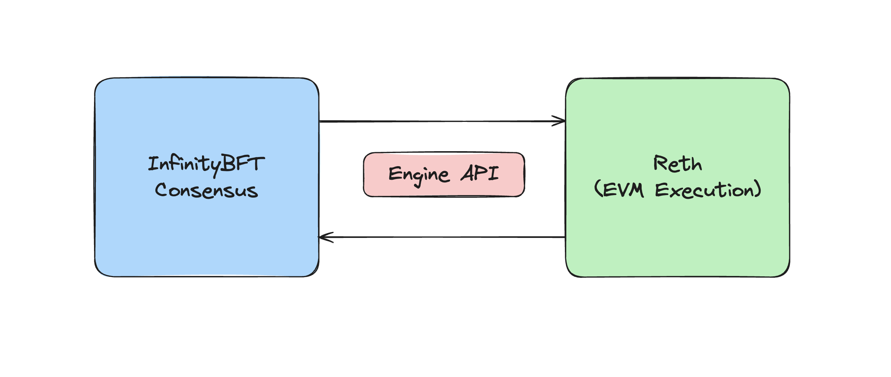

# Infinity L1

## Overview

Infinity is a high-performance EVM-compatible layer-1 blockchain. Infinity is built with a modular architecture separating consensus and execution.

### Consensus

The Infinity L1 uses InfinityBFT, a single-slot finality consensus protocol. This is how nodes gossip and produce blocks, and agree on the contents of each block. The consensus layer is also inspired by the Ethereum beacon chain (for more info, read the [ETH 2.0 spec](https://eth2book.info/capella/part3/containers/state/)), and maintains the state of the beacon chain.

### Execution

Infinity uses [Reth](https://github.com/paradigmxyz/reth) as its high-performance execution engine via the [Engine API](https://hackmd.io/@danielrachi/engine_api). Reth is responsible for executing the EVM execution payload in each beacon block, and for gossipping EVM transactions plus blocks between execution nodes. By using Reth, we can take advantage of all its battle-tested code, and benefit from planned future features such as parallel EVM execution and Reth's goal of [1 gigagas per second](https://www.paradigm.xyz/2024/04/reth-perf).

Because Infinity separates consensus and execution, **the chain is able to add custom reorg logic to enshrine offchain compute in the chain's fork choice while still enjoying single-slot finality**. This is because the chain can just reorg the execution layer, while the consensus layer continues as normal.

## Technical Architecture

To better understand the architecture of the Infinity L1 and the optimizations we have made, please read:

- [<u>Block Lifecycle</u>](./lifecycle.md): Overview of the end-to-end lifecycle for proposing blocks, processing blocks, etc.
- [<u>Optimistic Payload Building</u>](./optimistic-payload.md): Performance optimization to prematurely build execution payloads
- [<u>Reorg Logic</u>](./reorg.md): Enshrining offchain compute into the fork choice of the Infinity L1

**Note:** It isn't required to understand any of these sections to build with InfinityVM.
