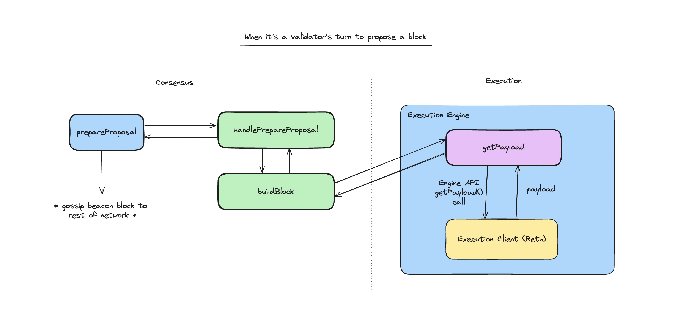
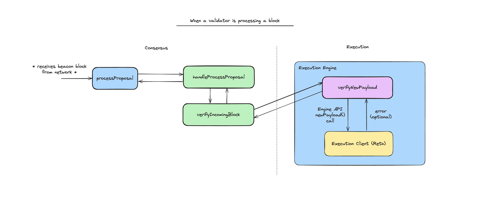
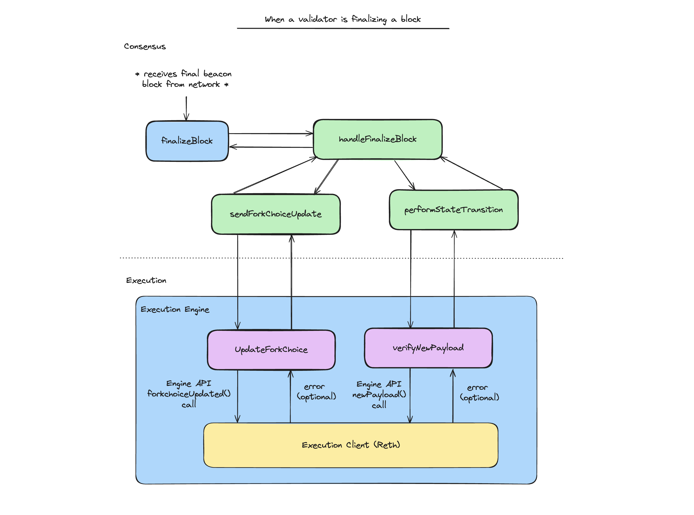

# Infinity L1

## Overview

The Infinity L1 architecture is based on [BeaconKit](https://github.com/berachain/beacon-kit). BeaconKit is a modular framework for building EVM based consensus clients.

At a high level, BeaconKit involves three components:

1. **Consensus:** This is how nodes gossip and produce blocks, and agree on the contents of each block. BeaconKit uses CometBFT as a default for consensus, but this could be replaced by other consensus protocols (i.e. Hotstuff, Avalanche consensus, etc.)
2. **Execution:** This is an execution engine running any Ethereum execution client (i.e. Reth, Geth, Erigon, etc.). This component is responsible for executing the execution payload in each block, and for gossipping EVM transactions and blocks between execution nodes. Because BeaconKit uses standard Ethereum execution clients, we are able to make use of the battle-tested gossip and p2p messaging layer already built into these clients.
3. **BeaconKit Runtime:** This is the glue between the CometBFT/ABCI and execution layers. The BeaconKit runtime runs the Ethereum beacon chain and maintains the state of the beacon chain (for more info on the beacon chain, read the [ETH 2.0 spec](https://eth2book.info/capella/part3/containers/state/)). It listens for events emitted from ABCI handlers in consensus (i.e. `PrepareProposal`, `ProcessProposal`, etc.), and initiates calls to the execution client using the [Engine API](https://hackmd.io/@danielrachi/engine_api).

## Key modules

BeaconKit follows a service-based architecture, with code separated into different modules and a service that can be run for each module. A list of modules with the core BeaconKit logic and a description of each module is provided below:

- `beacon`: Most of the BeaconKit logic.
- `execution`: This is the execution engine, which is essentially a shim around the execution client (i.e. Reth). It communicates with the execution client using the Engine API.
- `consensus`: Code related to CometBFT and middleware handlers for ABCI like `PrepareProposal`, `ProcessProposal`, and `FinalizeBlock`.
- `payload`: Code to request building payloads on the execution client and retrieving execution payloads. The `beacon` module routes some payload-related calls to the execution engine through the `payload` module.
- `state-transition`: Code to run the [beacon chain state transition function](https://eth2book.info/capella/part3/transition/). This includes processing slots and blocks, which involves verifying validity conditions and processing payloads, staking deposits and withdrawals, etc.

## Event-driven lifecycle

BeaconKit follows a general pattern of an event-driven lifecycle. This works like this:

1. Events are emitted when the ABCI handlers are run. For example, the `NewSlot` event is emitted when `PrepareProposal` is run.
2. These events are picked up by the BeaconKit runtime (`beacon` module).
3. BeaconKit makes calls to the execution engine, which communicates with the execution client through the Engine API.
4. If relevant, the `beacon` module can return some data (such as validator updates) through channels which are received by the `consensus` module.

Now, we go through a few end-to-end flows across this lifecycle:

### Proposing a block

When it's a validator's turn to propose a block, `PrepareProposal` is run which emits a `NewSlot` event. This is handled by the `beacon` module, which retrieves the execution payload from the execution engine by making a `getPayload()` Engine API call. The built beacon block is then gossiped to the rest of the network.

### Processing a block

When a validator receives a beacon block from the proposer, the `ProcessProposal` ABCI handler is run. The `beacon` module handles the beacon block received, and a `newPayload()` Engine API call is made to the execution engine to validate the execution payload in the block.

### Finalizing a block

When a validator receives a final beacon block from the network, the `FinalizeBlock` ABCI handler is run. The `beacon` module handles this, and triggers two things:

1. It executes the state transition function and makes a `newPayload()` Engine API call to the execution engine to process the execution payload and compute a list of validator updates.
2. It sends a `forkChoiceUpdate()` to the execution engine to notify the execution client of the latest block being finalized.

The `FinalizeBlock` handler then returns the validator updates to the CometBFT consensus layer.

## Optimistic payload building

To improve performance, BeaconKit optimistically builds execution payloads. This means that when processing a block proposal at height `N`, a validator prematurely requests the execution engine to start building an execution payload for the next block. This improves performance in the case that this validator ends up being the proposer for the next block.

