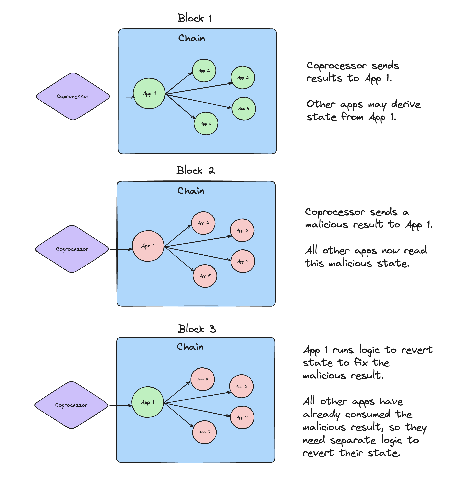
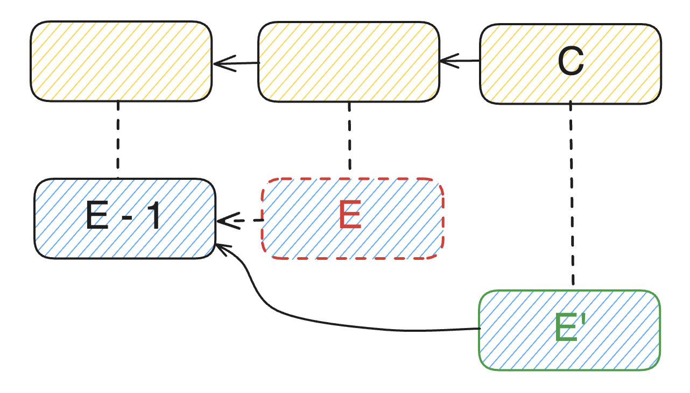

# Fork Choice

The InfinityVM architecture achieves real time coprocessing by executing jobs in a normal VM instead of generating costly and time consuming ZK proofs upfront. On a trad blockchain, if results are optimistically accepted, the application needs to be able to handle cases where the result is later proven wrong. This also means that downstream apps need to handle the toxic result. InfinityVM solves this by ensuring that the canonical chain only ever includes valid coprocessing results.

*The toxic fallout of a bad coprocessing result on a trad blockchain.*

To ensure that Infinity's canonical chain does not contain invalid coprocessing results, the chain will abandon blocks with invalid results. The set of conditions for rejecting certain blocks is typically called the fork choice rules. On top of the typical fork choice rules for single slot finality BFT algorithms, we also include the condition that if a coprocessing fraud proof is submitted within the fraud period, the execution chain block containing the result (and the fork building on it) is invalid.[^note1]

To achieve these fork choice capabilities, we pursue an approach that decouples consensus and execution such that there is a separate consensus chain and execution chain [^note2]. The benefit is that the consensus chain will have single slot finality while the execution chain will be subject to roll back within a fraud proof period [^note3]. Effectively, the state transition function of the consensus chain enforces this fork choice rule of the execution chain.

[^note1]: Checkout the [InfinityVM litepaper](https://infinityvm.xyz/infinityvm_litepaper.pdf) for more motivation on why this forkchoice rule is important.
[^note2]: Outside of this section we refer to execution chain blocks as execution payloads and consensus chain blocks simply as blocks. In this section, we refer to them as separate chains to illustrate how the execution chain can independently be rolled back. For context, the consensus chain blocks contain the execution payload and the root of execution chain state, in addition to the root of consensus chain state. The execution client also independently propagates execution blocks.
[^note3]: The fraud period is the maximum length of consensus blocks after job results are posted that a fraud proof can be posted. So if a bad result is in the execution payload for block `C`, the latest that execution payload can be reverted is block `C + FRAUD_PERIOD`.

## High level flows

*The execution chain choosing a different fork while the consensus chain makes monotonic progress.*

### Notation

- `E` is the execution chain block containing a fraudulent coprocessor result.
- `E - 1` is the parent block of `E`.
- `E'` is the replacement for `E` and becomes the canonical child of `E - 1`.
- `C` consensus chain block that contains execution payload for `E'`.

### Block Proposing

Steps for a validator to propose a consensus block that rolls back the execution chain:

1) Proposer receives a coprocessor fraud proof via p2p networking. The proof indicates a fraudulent coprocessor result in execution chain block E. 
1) Proposer successfully verifies proof.
1) Proposer starts constructing `C`, including the fraud proof in the block body.
1) Proposer requests the creation of execution payload for `E'` by calling [`engine_forkchoiceUpdated`](https://github.com/ethereum/execution-apis/blob/main/src/engine/cancun.md#engine_forkchoiceupdatedv3) against the Execution Client (EC), specifying `headBlockHash = E - 1`.
1) Proposer retrieves the payload for `E'`, and includes the payload in `C`.
1) Proposer finishes constructing `C` and proposes it to the network.

### Block Verification

Steps for a validator to verify a consensus block that rolls back the execution chain:

1) Verifier receives `C`, containing a fraudulent coprocessor result from `E` and execution payload from `E'`. 
1) Verifier successfully verifies the proof (or the block is rejected, the proposer is penalized and we exit).
1) Verifier verifies execution payload for `E'` by calling [`engine_newPayload`](https://github.com/ethereum/execution-apis/blob/main/src/engine/cancun.md#engine_newpayloadv3) against the EC, (where the `parentHash = block E - 1`).
1) Once the verifier completes the remaining checks and staking accounting[^note3], the consensus chain has monotonically advanced one block. Effectively, the execution chain has been rolled back to not include the fork building on `E` and instead having the head `E'`.

[^note4]: Part of the accounting is processing deposits and withdrawals between the execution layer and consensus layer. For both deposits and withdrawals, there is a delay of fraud proof period + 1 between when they are requested and when they can be credited in the target layer. This is to ensure that slashes cannot be forked out of the execution layer