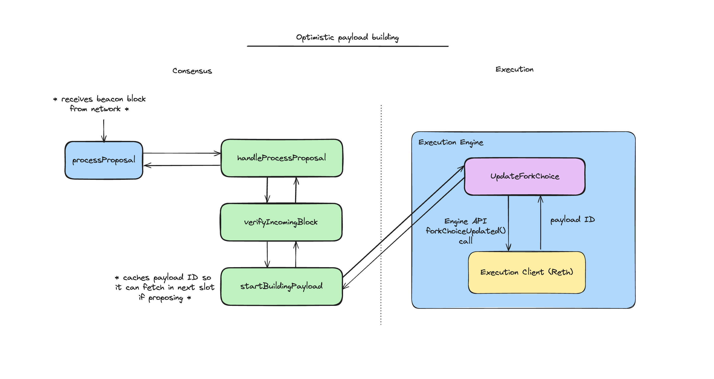

# Optimistic Payload Building

To improve performance, Infinity optimistically builds execution payloads. This means that when processing a block proposal at height `N`, a validator optimistically requests the execution engine to start building an execution payload for block `N + 1`. If they are the next proposer, they can then immediately use this payload in their proposed block.

