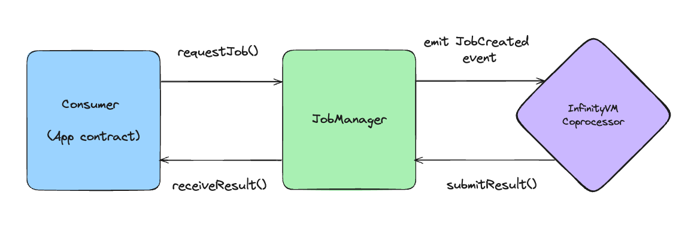

# Contracts

**Note:** You don't need to read this section to build an app with InfinityVM. All the relevant info on contracts is already covered in the [Building with InfinityVM](../integration/README.md) sections.

## Coprocessor contracts

There is a single [`JobManager` contract](https://github.com/InfinityVM/InfinityVM/blob/zeke-reorg-docs/contracts/src/coprocessor/JobManager.sol) for the InfinityVM coprocessor, which is shared by all app contracts. All interactions between app contracts and the coprocessor go through the `JobManager`.

The flow looks like this:

1. An app contract (which implements the [`Consumer` interface](https://github.com/InfinityVM/InfinityVM/blob/zeke-reorg-docs/contracts/src/coprocessor/Consumer.sol)) calls `requestJob()` to make an onchain job request.
1. `requestJob()` makes a call to the `JobManager`, which emits a `JobCreated` event.
1. The InfinityVM coprocessor listens for events from the `JobManager`, and runs the zkVM program for the job once it picks up the event.
1. The coprocessor submits the result of the job back to the `JobManager` contract.
1. The JobManager makes a call to the app contract's `receiveResult()` function. The app contract can now use this result in any app logic.

### Interfaces

- [`Consumer`](https://github.com/InfinityVM/InfinityVM/blob/zeke-reorg-docs/contracts/src/coprocessor/Consumer.sol): For all app contracts using InfinityVM.
- [`OffchainRequester`](https://github.com/InfinityVM/InfinityVM/blob/zeke-reorg-docs/contracts/src/coprocessor/OffchainRequester.sol): For app contracts using offchain job requests.
- [`SingleOffchainSigner`](https://github.com/InfinityVM/InfinityVM/blob/zeke-reorg-docs/contracts/src/coprocessor/SingleOffchainSigner.sol): For app contracts using offchain job requests which want to only allow a single authorized signer to sign job requests.
- [`StatefulConsumer`](https://github.com/InfinityVM/InfinityVM/blob/zeke-reorg-docs/contracts/src/coprocessor/StatefulConsumer.sol): For apps with [stateful app servers](../integration/offchain.md#stateful-app-servers) which want to ensure correctness of state.

We discuss these interfaces in more detail in the [Offchain Jobs](../integration/offchain.md) section.

## Payments

TODO

## Deployments

TODO
