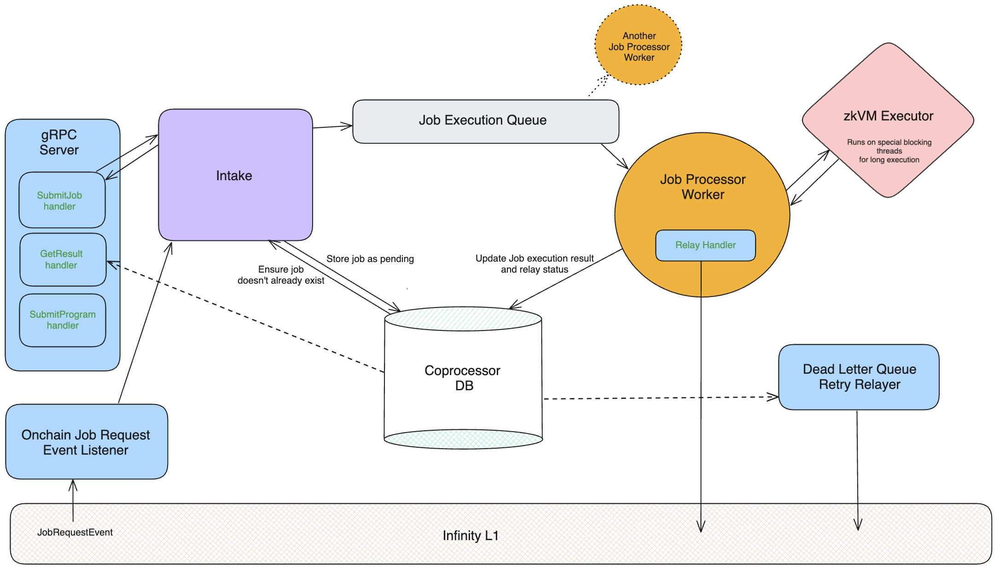

# Coprocessor Node Internal Architecture

This page discusses the internals of the coprocessor node and is geared primarily towards contributors.

## Lifecycle of a job request

The coprocessor node is designed to execute zkVM jobs that may potentially take awhile to complete. To work with long running jobs, the coprocessor node uses an async API that separates request intake and execution result retrieval.

1. Jobs can make their way into the node via either the gRPC server or the internal event listener. Both pass requests off to the intake.
1. Upon intake, requests are converted into an internal job type that will track the request, execution result, and relay status.
1. Intake will check that the job does not already exist, record the job in the DB as pending and then push it onto the execution queue.
1. Job processor workers pull jobs off the queue and then:
    1. Execute them via the zkVM executor
    1. Relay execution results onchain
    1. Update the job in the DB with the execution result and relay status
1. For jobs that failed to get relayed, they get placed in a dead letter queue and a background service will attempt to retry posting them onchain at a set interval.

## Diagram

This diagram shows the logical components involved in processing job requests from both web2 users (gRPC) and onchain requests (event listener). For simplicity, it does not include data flows for submitting programs. The diagram roughly shows the flow of a request from left to right.

<!-- https://app.excalidraw.com/s/8oh7cYrMkAR/4Aups68pO9j -->

Legend:

* Blue: external IO.
* Orange: worker threads.
* Red: long running execution.
* Directional arrow: data traveling in the given direction.

### Components

* **DB:** We use [MDBX](https://erthink.github.io/libmdbx/intro.html) due to its superior performance over other embedded KV DBs, such as RocksDB.
* **Queue:** The queue is just a [mpmc async channel](https://docs.rs/async-channel/latest/async_channel/fn.bounded.html).
* **DLQ:** The dead-letter queue is implemented using a table in the DB and a long lived tokio task.
