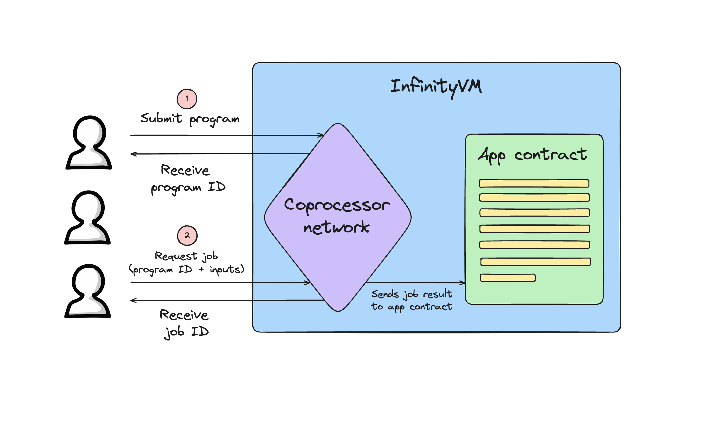

# Building with InfinityVM

 InfinityVM enables developers to use expressive offchain compute alongside the EVM to create new types of applications. This section discusses key concepts for building an app with InfinityVM.

## Overview

The InfinityVM coprocessor allows developers to run a zkVM program with any set of inputs and then use the results onchain. The high-level flow looks like this:

1. An app submits a zkVM program to the coprocessor. The coprocess returns a program ID (unique identifier for program).
2. An app contract or an offchain user/server requests a `job` from the coprocessor. Each job request contains the program ID and inputs to the program.
3. The coprocessor executes this program with the given inputs in a RISC-V interpreter.
4. The coprocessor submits the result (output of program) back to the contract.
5. The app contract can simply use the result from the coprocessor in any of their app logic. A callback function is called on the app contract, which can then execute arbitrary logic.

Importantly, InfinityVM guarantees that the canonical execution chain only contains valid job results.

### Writing a zkVM Program

Read more in the [Writing a Program](./writing-program.md) section.

### Using a zkVM Program

A zkVM program can be run in InfinityVM using two types of job requests: **onchain** and **offchain**. Read more in the [Using a Program](./using-program.md) section.

### Examples

We have walked through two examples of building apps with InfinityVM:
- [<u>Onchain Example: Square Root</u>](./square-root.md)
- [<u>Offchain Example: CLOB</u>](./clob.md)
