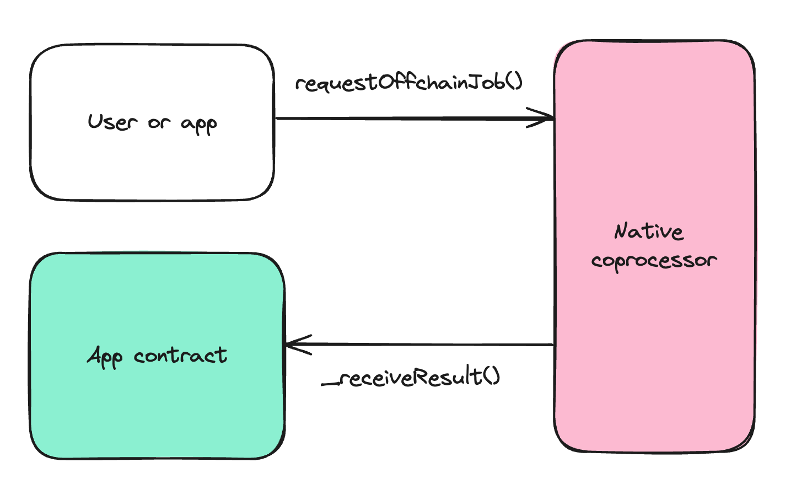

# Integration Concepts

 InfinityVM enables developers to use expressive offchain compute alongside the EVM to create new types of permissionless applications. This section discusses the specific affordances of InfinityVM for building such applications.

## Coprocessing Jobs

Core to offchain compute is the notion of a coprocessing job. Each request for compute to the InfinityVM coprocessor is called a Job. A job reflects a single invocation of a zkVM program with a specific set of inputs. The job request contains a program ID and inputs to the program. Valid job requests are picked up by a coprocessing node (CN), and the requested program along with the specified inputs get executed in a RISC-V interpreter. The result of a job (i.e. the programs output), can be configure to be posted either fully or partially onchain[^note1]. When a job result is posted onchain, it will call a callback for a specified contract, which can then execute arbitrary logic. Importantly, InfinityVM guarantees that the canonical execution chain only contains valid job results.

There are two paradigms for requesting jobs: onchain and offchain.

[^note1]: In the case of partially posting results onchain, a commitment to the full result and its inclusion in DA is included.

### Onchain

Onchain job requests are initiated by an event emitted from a smart contract. Typically we expect the smart contract to be triggered to emit the event by user interaction. But in some designs, contract callback handling logic for a previous job result may trigger a new job request event, effectively creating a continuous loop of requests without user interaction.

### Offchain

Offchain job requests are are triggered by sending a request directly to a coprocessor nodes' submit job endpoint. The result will be submitted onchain and can also be queried directly from the CN.

