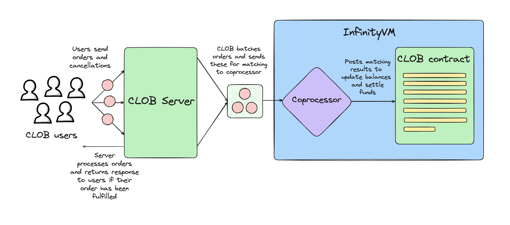

# Offchain Example: CLOB

In this section, we walk through an example of an offchain app server: a central-limit order book (CLOB).

## Why build a CLOB with InfinityVM

Fully onchain CLOBs are inefficient for two reasons:
1. It is expensive to run all order book matching logic onchain and store all order book state onchain.
1. Every time a user places or cancels an order, this needs to be an onchain transaction. Needing to pay a transaction fee for every user action is infeasible.

With InfinityVM, a CLOB is able to solve these problems by running an App Server. This server accepts orders and cancellations from users directly offchain and so users don't need to pay a transaction fee for every action. Meanwhile, by running the matching logic in the InfinityVM coprocessor, the CLOB is able to run matching efficiently without sacrificing any verifiability.

## Code Overview

The CLOB app contract is [`ClobConsumer.sol`](https://github.com/InfinityVM/InfinityVM/blob/main/contracts/src/clob/ClobConsumer.sol).

All code for the CLOB server lives in [`clob/`](https://github.com/InfinityVM/InfinityVM/tree/main/clob) in the InfinityVM repo. Specifically:

- [node](https://github.com/InfinityVM/InfinityVM/tree/main/clob/node): the CLOB service. 
- [client](https://github.com/InfinityVM/InfinityVM/tree/main/clob/client): client for seeding accounts, depositing, placing orders, withdrawing, and viewing state.

The zkVM program for the CLOB is [`clob.rs`](https://github.com/InfinityVM/InfinityVM/blob/main/clob/programs/app/src/clob.rs). 

**Note:** Because the CLOB logic is non-trivial, we defined a lot of the code in separate crates so the code can be easily reused in the app server and unit tested without the restrictions of the zkVM. For example, the CLOB's zkVM program has a [stf function](https://github.com/InfinityVM/InfinityVM/blob/main/clob/core/src/lib.rs#L275) defined in a `core` crate. This function is a wrapper around the [CLOB engine's tick function](https://github.com/InfinityVM/InfinityVM/blob/main/clob/core/src/lib.rs#L282), which processes a single request at a time. By design, the app server code also uses this same exact [tick function](https://github.com/InfinityVM/InfinityVM/blob/main/clob/node/src/engine.rs) to process each request.

## High-level user flow

The CLOB example only allows users to exchange two tokens: a `baseToken` and a `quoteToken`.

The user flow looks like this:



1. A user deposits `baseToken` and/or `quoteToken` into the CLOB contract.
1. The user can place an order by sending an order directly to the CLOB server. The CLOB processes these orders in real time. 
1. The CLOB server has a background process that regularly batches orders. It sends each batch along with the state of user balances + order book to the InfinityVM coprocessor.
1. The InfinityVM coprocessor runs the CLOB matching logic in the zkVM program to match orders.
1. The coprocessor posts the result to the CLOB contract.
1. The CLOB contract uses the result to update the user balances stored on the contract.

### Onchain state

The only state stored onchain in the CLOB app contract are the user balances for each token.

### User actions

A user can perform these actions:

1. `Deposit`: User sends a transaction onchain to transfer some amount of `baseToken` and/or `quoteToken` to the CLOB contract. 
1. `Create`: User places an order by sending this directly to the CLOB server. 
1. `Cancel`: User cancels an order by sending this directly to the CLOB server.
1. `Withdraw`: User withdraws funds from the CLOB contract by sending this directly to the CLOB server.

## Sending job requests to the InfinityVM coprocessor

The CLOB server batches user orders and sends offchain job requests to the InfinityVM coprocessor.

From [Offchain Jobs](./offchain.md), the API for submitting a job to the coprocessor is:

```rust,ignore
message SubmitJobRequest {
  bytes request = 1; // ABI-encoded offchain job request
  bytes signature = 2;
  bytes offchain_input = 3;
  bytes state = 4;
}

struct OffchainJobRequest {
    uint64 nonce;
    uint64 maxCycles;
    address consumer;
    bytes programID;
    bytes onchainInput;
    bytes32 offchainInputHash;
    bytes32 stateHash;
}
```

The CLOB uses `offchain_input` since we need to pass in a large number of orders as input in each batch. This `offchain_input` contains:
- the new batch of orders/cancels/deposits/withdraws
- user signature for each order in the batch

We also use `state` since the CLOB is a stateful app server, where the state contains all user balances in the CLOB along with the order book.

The `offchain_input` and `state` is borsh-encoded by the CLOB server before submitting to the coprocessor.

## zkVM program

The zkVM program takes in `state` and `offchain_input` as inputs. It does these things:

1. Decodes `state` and `offchain_input`
1. Verifies that the signature on every order in the batch is valid
1. Runs the CLOB matching function, which takes in the batch from `offchain_input` and the existing order book from `state` as inputs. We won't explain this function in detail here, but the code for this is in [`zkvm_stf`](https://github.com/InfinityVM/InfinityVM/blob/main/clob/core/src/lib.rs#L275).
1. Returns an ABI-encoded output, which includes the hash of the new CLOB state and a list of state updates which will be processed by the CLOB app contract.

The list of state updates sent to the CLOB contract is structured like this:

```rust,ignore
struct ClobResultDeltas {
    DepositDelta[] depositDeltas;
    OrderDelta[] orderDeltas;
    WithdrawDelta[] withdrawDeltas;
}
```

The CLOB contract receives this list of state updates and processes it to update user balances.

## Ensuring correctness of the `state`

In [Stateful App Servers](./offchain.md#stateful-app-servers), we discussed the problem of ensuring the correctness of the state submitted by an app server to the coprocessor.

The `ClobConsumer` contract implements the [`StatefulConsumer`](https://github.com/InfinityVM/InfinityVM/blob/main/contracts/src/coprocessor/StatefulConsumer.sol) interface, to verify that the state hash submitted by the CLOB server in the job request is correct.
