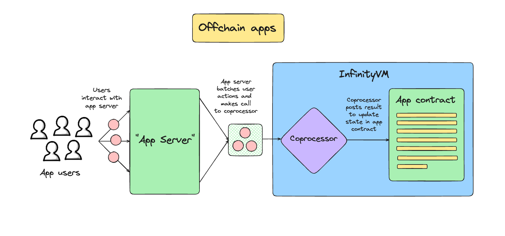

# Offchain Jobs

Offchain jobs enable you to send job requests directly to the InfinityVM coprocessor. This is done using the coprocessor node's gRPC or REST API. The result of executing a job is still submitted onchain to your app contract, similar to onchain jobs.

## High-level flow

The flow for a simple offchain job is:

1. User or app sends a job request using the coprocessor node's gRPC or REST API. This involves sending a signature over the job request as well.
2. The InfinityVM coprocessor executes your zkVM program with the inputs from the job request.
3. The coprocessor posts the result of executing the job onchain, and this can now be used by the app contract. 

**Note:** For offchain jobs, the coprocessor also posts the job request onchain. This is because the InfinityVM contracts need to verify that the metadata which the coprocessor commits to when posting the result (program ID, input, etc.) matches the metadata in the job request. This isn't required for onchain jobs since the job request happens onchain anyway.

### App Servers

If your app sends job requests, there is an interesting class of applications that run as real-time servers. More info on this in the [`App Servers`](./offchain.md#app-servers-1) section below. 

## gRPC/REST endpoints

### SubmitJob

A user or an app can send a job request directly to the InfinityVM coprocessor using the [`SubmitJob` endpoint](../coprocessor/api.md#coprocessor_nodev1coprocessornodesubmitjob):

```rust,ignore
// SubmitJobRequest defines the request structure to submit a job to the
// coprocessing coprocessor_node.
message SubmitJobRequest {
  bytes request = 1; // ABI-encoded offchain job request
  bytes signature = 2; // Signature on ABI-encoded offchain job request
  bytes offchain_input = 3; // Value of offchain input passed into program (this isn't signed over)
  bytes state = 4; // Value of state passed into program (this isn't signed over)
}
```

This includes the actual job request (ABI-encoded), a signature over the request, and `offchain_input` and `state` (we explain `offchain_input` and `state` later in this doc). The job request is an ABI-encoded version of this:
```rust,ignore
struct OffchainJobRequest {
    uint64 nonce;
    uint64 maxCycles; // Max number of cycles to execute program in zkVM
    address consumer;
    bytes programID;
    bytes onchainInput;
    bytes32 offchainInputHash;
    bytes32 stateHash;
}
```
A few notes:
- `consumer`: address of your app contract.
- `programId`: unique ID of your program. You can get the program ID when you submit your program to the coprocessor node's [`SubmitProgram` endpoint](../coprocessor/api.md#coprocessor_nodev1coprocessornodesubmitprogram).
- `maxCycles`: max number of cycles to execute your program in zkVM.
- `nonce`: each job request for a particular app contract has a unique nonce, to prevent replay attacks. More info on this in [`Writing your app contract`](./offchain.md#writing-your-app-contract) below.

The `SubmitJob` endpoint returns a **unique Job ID** for the job.

### GetResult

Once the InfinityVM coprocessor executes your zkVM program with the inputs, it will submit the result onchain, but you can also query the result offchain if you'd like. You can use the coprocessor node's [`GetResult endpoint`](../coprocessor/api.md#coprocessor_nodev1coprocessornodegetresult). This takes in the job ID as input and returns the job result + metadata (program ID, job status, inputs for program, etc.).

## Onchain vs offchain input

As noted earlier, for offchain jobs, the InfinityVM coprocessor posts the job request onchain as well when posting the result of the job. The job request includes the inputs for the zkVM program; so apps that need to pass in large amounts of input might find this to be a bottleneck. To solve this, we introduced two types of input passed into the zkVM program: onchain and offchain.

### Onchain Input
Inputs that are included in the signed job request and are posted onchain along with the result. An app might need to use these inputs in some logic in their app contract, for example, and so would need these inputs posted onchain.

### Offchain Input
Offchain inputs are submitted offchain to the coprocessor but *only the hash* of these inputs are posted onchain along with the result. The actual values of the inputs are made available on the Infinity L1's DA or an alternative DA. This allows an app to use large amounts of input in their zkVM program without the chain's bandwidth being a bottleneck.

The `offchain_input` field in `SubmitJobRequest` is the actual value of the input passed to the zkVM program and posted to DA, and an app needs to sign over the hash of `offchain_input` in the job request sent to the InfinityVM coprocessor.

## App Servers

Your app can run as a real-time server, leveraging offchain job requests:

1. This server can accept and process user requests in real-time.
2. It can regularly batch these requests and submit them to the InfinityVM coprocessor as the input in an offchain job request.
3. You can write some state transition logic in your zkVM program which performs some logic on each batch of inputs.
4. The result of each job is submitted onchain and immediately usable by the app contract. The app contract maintains some state which is updated by the result of the coprocessor.



With the power of this architecture, an app can own the relationship with users and provide real-time experiences to users since users directly interact with the app server. At the same time, apps still enjoy all the benefits of maintaining state and settling funds onchain.

Apps can also choose how to scale their infrastructure. Since it's a server, you can easily use battle-tested web2 scalability solutions.

We walk through a detailed example of building an app server in [Offchain Example: CLOB](./clob.md).

#### Stateful App Servers

Some app servers might be "stateful", i.e. they maintain some state, which is passed into a zkVM program along with some inputs, and then the result of the program is used to update this state. For example, a CLOB app might have user balances + the existing order book as the state of the app.

This is why we have the `state` field in `SubmitJobRequest`, which apps can use to submit their state along with a job request.

This raises an interesting problem: how do we ensure that app servers submit the correct state to the coprocessor? For example, if the latest state on the app contract is `X` but the app server submits `Y` as the `state` in the next job request, how do we prevent this? To solve this, we have created the [`StatefulConsumer`](https://github.com/InfinityVM/InfinityVM/blob/zeke-reorg-docs/contracts/src/coprocessor/StatefulConsumer.sol) interface which your app contract can inherit. This adds a few checks in `receiveResult()` which verify that the state hash submitted by the app server in the job request matches the most recent state hash in the app contract.

## Writing your app contract

Similar to onchain jobs, any app contract building with InfinityVM needs to inherit the [`Consumer`](https://github.com/InfinityVM/infinity-foundry-template/blob/main/contracts/src/coprocessor/Consumer.sol) interface. To build an app, you don't need to read how `Consumer` or any of the other contracts in [`contracts/src/coprocessor`](https://github.com/InfinityVM/infinity-foundry-template/tree/main/contracts/src/coprocessor) are implemented; you can just focus on your app.

For apps that use offchain jobs, you can also inherit [`OffchainRequester`](https://github.com/InfinityVM/InfinityVM/blob/zeke-reorg-docs/contracts/src/coprocessor/OffchainRequester.sol), which contains the `isValidSignature()` function. You need to implement `isValidSignature()` in your app contract, which is called to verify that an offchain request is signed by an authorized signer/user. 

We've provided an example implementation of `isValidSignature()` which you can use in the [`SingleOffchainSigner.sol` contract](https://github.com/InfinityVM/InfinityVM/blob/zeke-reorg-docs/contracts/src/coprocessor/SingleOffchainSigner.sol) (this checks that each job request is signed by a single pre-defined `offchainSigner` address). But, you can implement any logic or checks you'd like. For example, you could store a list of whitelisted users in your app contract and add logic in `isValidSignature()` to verify that every job request is signed by some whitelisted user.

Finally, you need to write a `_receiveResult()` callback function which accepts the output from the InfinityVM coprocessor running your program. You can write any app logic in this function and even call into any other functions you'd like.

#### Nonces

Each job request for an app contract must have a unique nonce submitted with it, to prevent replay attacks. The [`Consumer`](https://github.com/InfinityVM/infinity-foundry-template/blob/main/contracts/src/coprocessor/Consumer.sol) interface inherited by all app contracts contains a `getNextNonce()` function to return the next nonce to be used by both onchain and offchain job requests, and an `updateLatestNonce()` function to update the latest nonce value once a job has been submitted.

We have provided a default implementation for `getNextNonce()` and `updateLatestNonce()` in Consumer.sol to implement a simple nonce which increases by 1 every time a job is requested. This should be good enough for most apps, but you can override it in your app contract if you'd like. For example, you could use the unix timestamp in milliseconds as the nonce for offchain calls to the coprocessor.

## Testing your app

If your app involves sending offchain job requests directly to the InfinityVM coprocessor without an app server, you can use the [`Infinity foundry template`](https://github.com/InfinityVM/infinity-foundry-template/tree/main) to test your app. You can write tests for the end-to-end flow of your app in Solidity similar to any other foundry tests. We have built a Solidity SDK within the foundry template which allows you to request and receive compute from InfinityVM within the foundry tests.

Specifically, you just need to call `requestOffchainJob()` in the foundry tests to send an offchain job request to the coprocessor. We have written an example test [`test_Consumer_RequestOffchainJob()`](https://github.com/InfinityVM/infinity-foundry-template/blob/f032050b3276b6f232f94aa6a3dcd375c833d577/contracts/test/SquareRootConsumer.t.sol#L41) in [`SquareRootConsumer.t.sol`](https://github.com/InfinityVM/infinity-foundry-template/blob/main/contracts/test/SquareRootConsumer.t.sol). This test sends an offchain request for the square root of a number directly to the coprocessor, using `requestOffchainJob()`. It verifies that the coprocessor submits the correct result back to the `SquareRootConsumer.sol` contract.

#### Testing an App Server

Because of the limitations of foundry, we don't have an SDK to write end-to-end tests for an app server in Solidity. Instead, you would need to write tests for your app server similar to how you would write tests for any other infrastructure or web2 service. For example, we have written tests for the [CLOB app server example](./clob.md) in the [`clob.rs` file](https://github.com/InfinityVM/InfinityVM/blob/main/test/e2e/tests/clob.rs) in Rust. You can reuse a lot of logic from these tests to write tests for your own app server.
