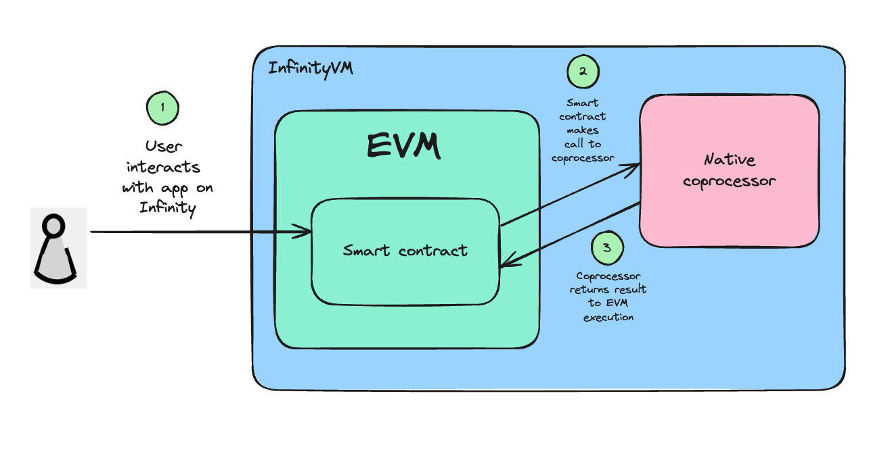

# Onchain jobs

### Onchain

Onchain job requests are initiated by an event emitted from a smart contract. Typically we expect the smart contract to be triggered to emit the event by user interaction. But in some designs, contract callback handling logic for a previous job result may trigger a new job request event, effectively creating a continuous loop of requests without user interaction.

