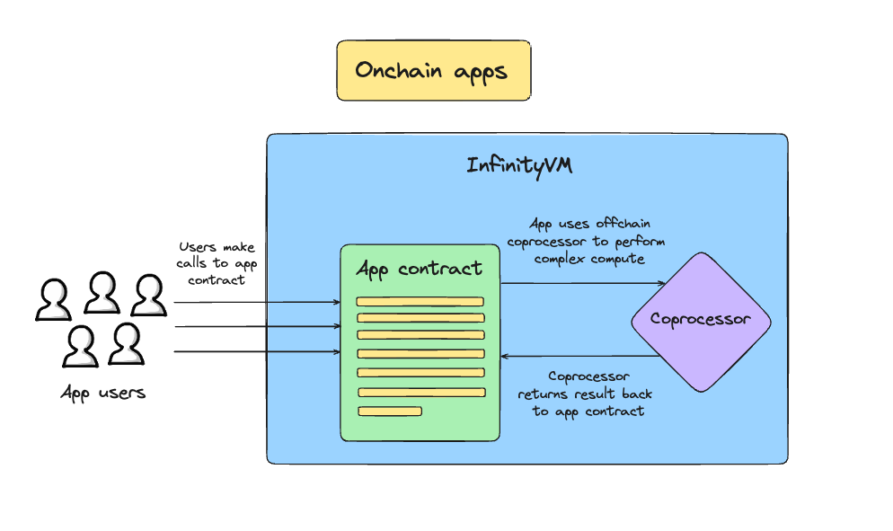

# Onchain Jobs

For building an app which uses onchain jobs, we recommend forking the [InfinityVM foundry template](https://github.com/InfinityVM/infinityVM-foundry-template/tree/main). We have similar instructions in the template's `README` to get started.

## Writing your app contract

Any app contract building with InfinityVM needs to inherit the [`Consumer`](https://github.com/InfinityVM/infinityVM-foundry-template/blob/main/contracts/src/coprocessor/Consumer.sol) interface. To build an app, you don't need to read how `Consumer` or any of the other contracts in [`contracts/src/coprocessor`](https://github.com/InfinityVM/infinityVM-foundry-template/tree/main/contracts/src/coprocessor) are implemented; you can just focus on your app.

Next, your app contract needs to do two things:

1. Call `requestJob()` with the program ID of your zkVM program along with ABI-encoded inputs that you want to pass into your program from the contract. If you're using the foundry template, we have instructions on how to generate the program ID in the `README`. Otherwise, you can get the program ID when you submit your program to the coprocessor node's [`SubmitProgram` endpoint](../coprocessor/api.md#coprocessor_nodev1coprocessornodesubmitprogram).
1. Write a `_receiveResult()` callback function which accepts the output from the InfinityVM coprocessor running your program. You can write any app logic in this function and even call into any other functions you'd like.

#### Initiating onchain job requests

Typically, we expect an onchain request to be triggered by user interaction with your app contract. But in some designs, contract callback handling logic for a previous job result may trigger a new request event, effectively creating a continuous loop of requests without user interaction.

## Testing your app contract

In the foundry template, you can write tests for the end-to-end flow of your app in Solidity similar to any other foundry tests. We have built a Solidity SDK within the foundry template which allows you to request and receive compute from InfinityVM within the foundry tests.

One example of this is [`test_Consumer_RequestJob`](https://github.com/InfinityVM/infinityVM-foundry-template/blob/main/contracts/test/SquareRootConsumer.t.sol). You can run the test using `forge test -vvv --ffi`.
