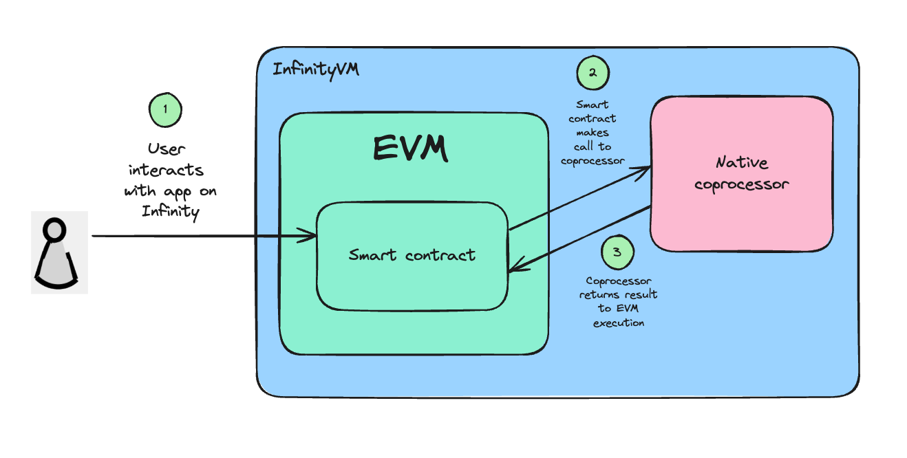

# Using a zkVM Program

To run your zkVM program in the InfinityVM coprocessor, you first need to submit your program to the coprocessor. You can do this using the [`SubmitProgram` endpoint](../coprocessor/api.md#coprocessor_nodev1coprocessornodesubmitprogram) in the coprocessor node's gRPC or REST API. You can submit your program's executable file (ELF) to the endpoint, and the coprocessor returns the program ID (unique identifier for the program).

After submitting your zkVM program, you can make a job request in two ways: onchain and offchain.

## Onchain requests

This allows you to make calls to the coprocessor from a smart contract. At a high level, this is how onchain requests work:

1. You make a call to the coprocessor from your app contract, and pass in your zkVM program ID and inputs. This emits an event that gets picked up by the coprocessor.
2. The InfinityVM coprocessor executes your zkVM program with the inputs.
3. You write a callback function in your app contract which accepts the coprocessor's output and uses it in any application logic.

You can read more in the [Onchain Jobs](./onchain.md) section.

## Offchain requests

This allows you to send requests directly to the InfinityVM coprocessor. This can be done using the coprocessor node's gRPC or REST API. The result will still be submitted onchain and can be used by a callback function in your app contract, similar to onchain requests.

Offchain job requests can be sent by a user, your app, or any authorized third-party. In the case that your app sends the requests, there is an interesting class of applications that run as real-time servers. 

You can read more in the [Offchain Jobs](./offchain.md) section.

